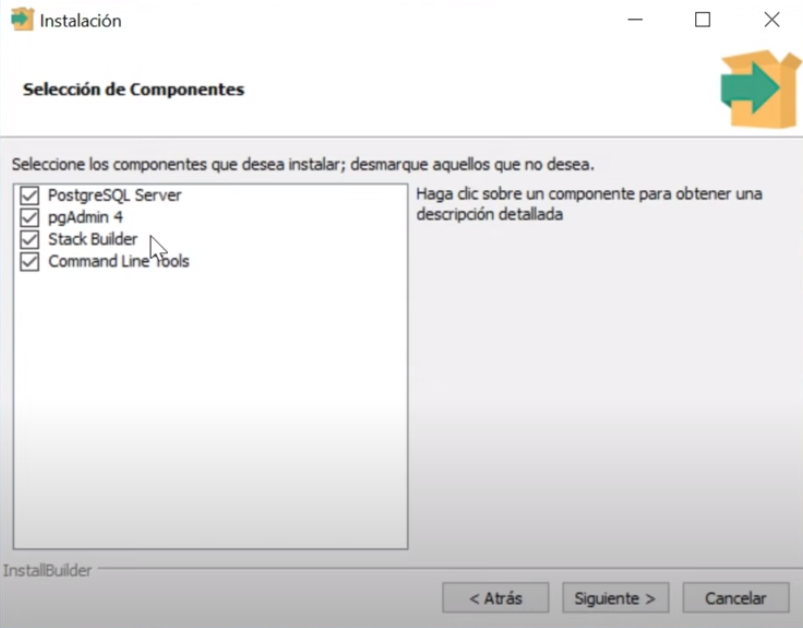

# Instalacion de Base de Datos Relacional

## 1. Seleccion
Dentro de la catedra, estaras realizando con un grupo a determinar un **proyecto integrador** de 4 entregas como maximo. Este proyecto requerira el uso de una **base de datos relacional** a eleccion del grupo.

Lo recomendado es que todos los integrantes preparen el entorno de desarrollo local en sus computadoras de forma tal que no existan inconvenientes para que un integrante clone y ejecute el proyecto en cualquier instancia de tiempo. En este documento se detallara como instalar las bases de datos relacionales mas utilizadas y recomendadas por la catedra.

Cabe destacar que si el grupo decide utilizar una base de datos no listada en este documento, recibira minima asistencia por parte del equipo docente en problemas que encuentre con ella.

## 2. Instalacion
Los pasos de instalacion estaran dados tanto para **Windows**, **Linux** y **Docker** (OS-agnostic).

Se aconseja el uso de **Docker** para evitar instalaciones fijas que pueden causar problemas en su uso.

### 2.1. PostgreSQL
#### 2.1.1. Descarga de Imagen
Para comenzar, primero debes descargar la imagen que contiene la ultima version de **Postgres** a tu disco local. Esto te ahorrara el tiempo de descarga. Puedes saltearte este paso, pero es aconsejable hacerlo.

Levanta una **terminal** (`powershell` en Windows) y escribe el siguiente comando: `docker pull postgres`

Comenzara a descargarse la imagen de Postgres mas reciente a tu disco local. Espera a que termine el proceso y ya tienes la imagen.

##### 2.1.1.1. Versiones Especificas
Si por alguna razon necesitas obtener una imagen especifica de Postgres, por favor revisa [el directorio oficial de **tags** de la imagen](https://hub.docker.com/_/postgres/tags) para buscar la que necesitas.

Una vez encuentres el tag, descargas la imagen a tu disco con esa etiqueta utilizando el mismo comando de la forma siguiente:

```bash
# Descargar imagen de Postgres con etiqueta '11.4-alpine' (Version 11.4 de Postgres)
$ docker pull postgres:11.4-alpine
```

### 2.2. MySQL
De la misma forma que Postgres, para **MySQL** puedes descargar la imagen utilizando el comando `docker pull mysql`.

Listado de Tags: https://hub.docker.com/_/mysql/tags

### 2.3. MariaDB
`docker pull mariadb`

Listado de Tags: https://hub.docker.com/_/mariadb/tags

## 3. Instalaciones Sin Docker
**Se desaconseja instalar las bases de datos directamente en el sistema operativo padre.**

En todo caso, puede lograr lo mismo que con Docker con una **instalacion nativa**.

### 3.1. Windows
Para instalar PostgreSQL en Windows, simplemente [descarga el instalador desde aqui](https://www.enterprisedb.com/downloads/postgres-postgresql-downloads).

Sigue los pasos del instalador. En la ventana de **Seleccion de Componentes** podras elegir si quieres o no la interfaz visual de Postgres en la caja de **pgAdmin**. 


Si no quieres interfaz visual, destickea la caja y continua. El resto dejalo todo marcado.

En la seccion de **puerto** deja el por defecto; no necesitaras cambiarlo y si lo cambias deberas recordar cual pusiste.

### 3.2. Linux


## 4. Ejecutar Instancia de Base de Datos
Antes de comenzar con los pasos pensar en lo siguiente; cuando virtualizamos aplicaciones o servicios, generalmente **no son persistentes** a menos que asignemos volumenes fisicos/virtuales de donde puedan obtener su informacion.

Para nuestro caso de uso, es una necesidad que nuestro contenedor de Docker **tenga persistencia de informacion**. Por esta razon, primero nos aseguraremos de configurar el entorno de nuestra PC local para **garantizar persistencia**.

### 4.1. Volumenes en Docker