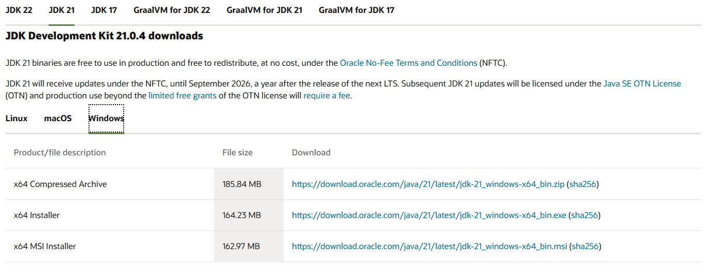

# Instalacion de Java Development Kit (JDK)

## 1. Prefacio

Esta pagina te explicara como instalar el kit de desarrollo de **Java** para ambas plataformas; Linux y Ubuntu.

Recuerda, **es requisito tener Java** instalado. Todos utilizaremos la version **21** que ofrece **Long Term Support (LTS)** para la realizacion del proyecto.

### 1.1. Validacion

Antes de comenzar, verifica no tener una instalacion actual de **OpenJDK** o **Java** en tu sistema. Para hacer esto, abre una terminal o una ventana de Powershell/CMD en Windows y escribe el comando `java -version`.

Si este comando te devuelve contenido, tienes una version de Java ya instalada. La salida del comando deberia ser algo similar a esto:
```bash
openjdk version "21" 2023-09-19
OpenJDK Runtime Environment (build 21+35-2513)
OpenJDK 64-Bit Server VM (build 21+35-2513, mixed mode, sharing)
```

Asegurate que tu version sea **21.x.x**. En caso de no serlo, **deberas desinstalar la version actual** y seguir los pasos de esta pagina para asegurarte de tenerla.

### 1.2. Utilizar Java 21

En caso de tener una version inferior o superior a Java 21, sigue estos pasos para utilizar la version correcta de Java en la catedra, destruyendo o no destruyendo la anterior version.

#### 1.2.1. Metodo I: Desinstalacion (Destructivo)

Este metodo causa **la eliminacion de las versiones anteriores** que tienes instaladas. Si necesitas utilizarlas luego para otros proyectos u objetivos, deberas **volver a instalarlas manualmente**.

##### 1.2.1.1. Ubuntu, Debian, CentOS

Pueden ocurrir 2 escenarios; que tengas **OpenJDK** o otro proveedor. Asegurate de saber cual tienes ejecutando el comando `java -version`.

Si es OpenJDK:
1. Abre una nueva terminal y ejecuta el siguiente comando.
```bash
$ sudo apt purge openjdk*
```

2. Verifica la eliminacion de OpenJDK ejecutando el comando `java -version`. Si no existe salida o da error, ha sido eliminado.

Si no es OpenJDK:
1. Abre una nueva terminal y ejecuta el siguiente comando.
```bash
$ sudo dpkg --list | grep -i jdk
```

2. Una lista de nombres aparecera. Toma cada nombre de la lista y escribe en tu terminal el siguiente comando:
```bash
$ sudo apt remove nombreDeLista
```

3. Repite el paso **2** por cada nombre.
4. Verifica la eliminacion de OpenJDK ejecutando el comando `java -version`. Si no existe salida o da error, ha sido eliminado.

##### 1.2.1.2. Windows

Si has instalado Java a traves de instaladores descargables:
1. Abre la aplicacion de **Configuracion** o **Settings**.
2. Dirigete a **Aplicaciones > Aplicaciones instaladas** o **Apps > Installed apps**.
3. Busca en la caja de busqueda `java` o `jdk`.
4. Da click derecho sobre los resultados y presiona en **Desinstalar** o **Uninstall**.
5. Sigue los pasos del desinstalador.

Si has instalado Java a traves de **Chocolatey**:
1. Abre una terminal de **Powershell**.
2. Escribe el comando `choco list`.
3. Ubica los nombres de paquete que corresponden a instalaciones de Java (OpenJDK, Oracle, IcedTea u otros).
4. Escribe por cada nombre encontrado el comando `choco uninstall nombreDePaquete`; por ejemplo, `choco uninstall openjdk`.

#### 1.2.2. Metodo II: Switching (No Destructivo)

Este metodo permite a uno **cambiar entre versiones de Java** sin desinstalarlas del sistema. Cada vez que quieras cambiar de version, lo puedes hacer sin tener conexion a internet o desinstalar/instalar algo nuevo.

**Nota**: Debes instalar las versiones que quieras **primero** (por ejemplo, la 21, 11 y 17) en tu sistema primero, o no podras seguir estos pasos.

##### 1.2.2.1. Ubuntu, CentOS, Debian

1. Abre una terminal.
2. Escribe el siguiente comando:
```bash
$ sudo update-alternatives --config java
There are 5 choices for the alternative java (providing /usr/bin/java).

  Selection    Path                                            Priority   Status
------------------------------------------------------------
* 0            /usr/lib/jvm/java-8-openjdk-amd64/jre/bin/java   1081      auto mode
  1            /usr/lib/jvm/java-6-oracle/jre/bin/java          1         manual mode
  2            /usr/lib/jvm/java-7-oracle/jre/bin/java          2         manual mode
  3            /usr/lib/jvm/java-8-openjdk-amd64/jre/bin/java   1081      manual mode
  4            /usr/lib/jvm/java-8-oracle/jre/bin/java          3         manual mode
  5            /usr/lib/jvm/java-9-oracle/bin/java              4         manual mode

Press <enter> to keep the current choice[*], or type selection number:
```

3. Toma nota de la ruta que ves en pantalla de la version que vas a elegir. Por ejemplo, si elijo la opcion 5 seria `/usr/lib/jvm/java-9-oracle/bin/java `. Copia esta ruta.
4. Elige tu opcion, en este caso la 5.
5. Escribe el siguiente comando para actualizar tu variable de entorno de `JAVA_HOME` (utilizada por muchos IDEs y otros programas para saber donde esta la instalacion de Java).
```bash
$ export JAVA_HOME="$(jrunscript -e 'java.lang.System.out.println(java.lang.System.getProperty("java.home"));')"
```

Repite estos pasos para cada cambio de version que quieras hacer.

##### 1.2.2.2. Windows

Sigue [**este tutorial**](https://www.youtube.com/watch?v=o2G1GNeebMo) para configurar tu entorno de Windows y administrar multiples versiones de Java.

## 2. Instalacion

### 2.1. Ubuntu, Debian, CentOS

1. Abre una terminal. Actualiza tus dependencias de `apt`.
```bash
$ sudo apt update -y && sudo apt upgrade -y
```

2. Instala **OpenJDK 21** desde el repositorio APT default.
```bash
$ sudo apt install openjdk-21-jdk -y
```

3. Verifica que tu instalacion fue exitosa.
```bash
$ java -version
openjdk version "21.0.2" 2024-01-16
OpenJDK Runtime Environment (build 21.0.2+13-Ubuntu-2)
OpenJDK 64-Bit Server VM (build 21.0.2+13-Ubuntu-2, mixed mode, sharing)
```

Ya tienes Java 21 instalado.

### 2.2. Windows

Tienes 2 metodos para instalar Java 21 / OpenJDK 21 en Windows.

#### 2.2.1. Metodo de Instalador Nativo
1. Dirigete **[a la siguiente pagina web oficial de Java](https://www.oracle.com/ar/java/technologies/downloads/#java21)**
2. Haz click sobre la solapa que dice **Windows**

3. Descarga el **instalador MSI** o **instalador EXE** haciendo click sobre el link que corresponda. Recomendado utilizar el **MSI**.
4. Sigue los pasos del instalador hasta que se complete.

Comprueba que tienes instalado Java correctamente abriendo una terminal `powershell` o `cmd` y escribiendo el comando **`java -version`**.

#### 2.2.2. Metodo de Chocolatey

[**Chocolatey**](https://community.chocolatey.org/) es un administrador de dependencias para sistemas de **Windows**. Es similar a los repositorios `apt` o `pacman` en sistemas operativos POSIX.

Para instalar **Open JDK 21** a traves de **Chocolatey** primero debes instalarlo.

1. Abre una nueva instancia de **`powershell`** como administrador.
2. Ejecuta el siguiente comando y espera a que finalice la instalacion.
```powershell
PS C:\Users\puntero> Set-ExecutionPolicy Bypass -Scope Process -Force; [System.Net.ServicePointManager]::SecurityProtocol = [System.Net.ServicePointManager]::SecurityProtocol -bor 3072; iex ((New-Object System.Net.WebClient).DownloadString('https://community.chocolatey.org/install.ps1'))
```

3. Verifica que se haya instalado correctamente usando el comando `choco --version `
```powershell
PS C:\Users\puntero> choco --version
2.3.0
```

(Nota: En caso de que `choco --version` diga que es un comando no reconocido pese a que la instalacion fue exitosa, cierra la ventana de Powershell actual y abre una nueva con permisos de administrador. Prueba alli ejecutar el comando nuevamente.)

Con Chocolatey instalado correctamente, ahora puedes instalar OpenJDK.
1. Ejecuta el comando `choco install openjdk --version=21.0.0`
   1. Si te consulta sobre si quieres ejecutar los scripts, dile que **si a todo** escribiendo `S` y `ENTER` o `A` en sistemas en ingles.
2. Espera a que finalice la descarga e instalacion de OpenJDK.
3. Cierra la ventana de Powershell utilizada recientemente y abre una nueva (no es necesario que sea con permisos de administrador).
4. Comprueba la instalacion correcta de Java 21 / OpenJDK escribiendo el comando `java -version`.
```powershell
PS C:\Users\puntero> java -version
openjdk version "21" 2023-09-19
OpenJDK Runtime Environment (build 21+35-2513)
OpenJDK 64-Bit Server VM (build 21+35-2513, mixed mode, sharing)
```